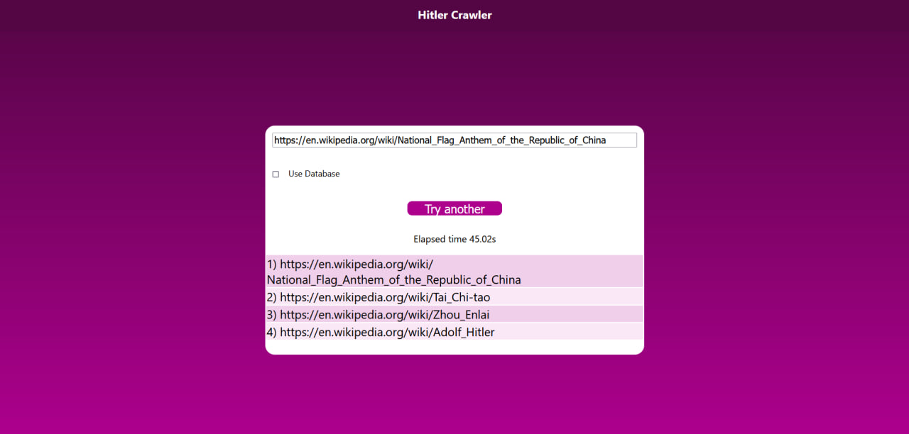
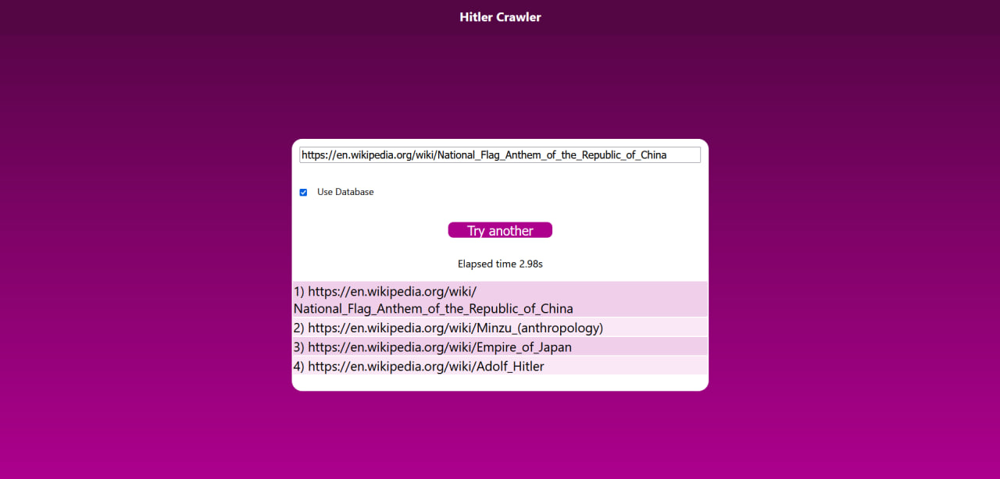
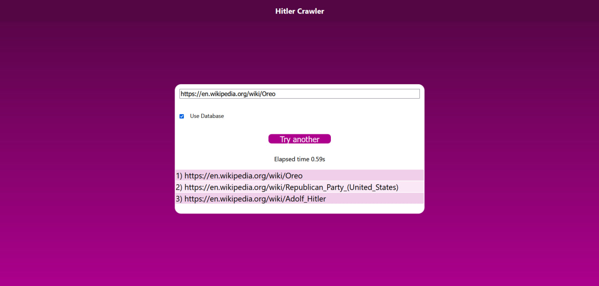
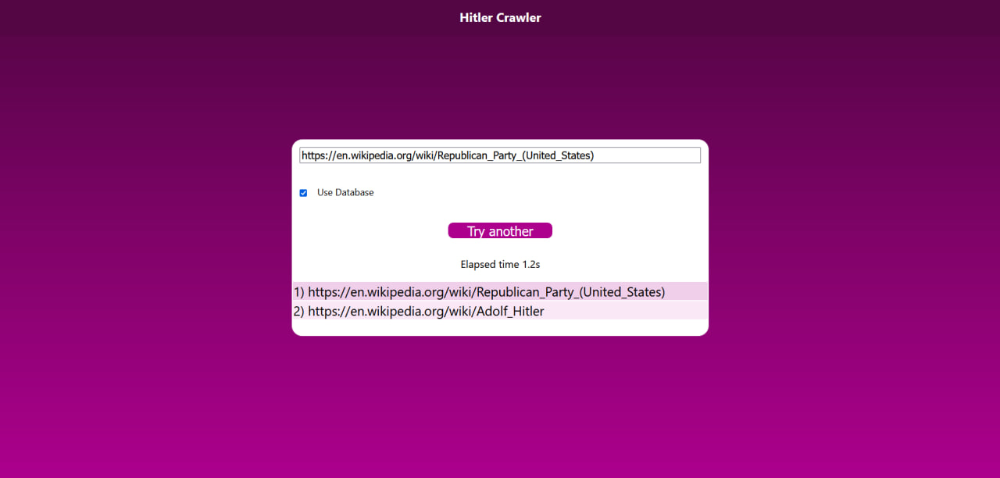

# Hitler crawler

Brute force - ~1,5 hours:
    
    Non-optimised method which works slowly, but gets correct results
    For this executing time for 3 redirects ~2200s, ~7s for 2 redirects
    For 4+ redirects is too long.

Brute force optimised ~ +1 hour: 

    Optimised version of brute force:

        Added Beautiful Soup 4 library for better parse performance
        Changed list to deque(double-edged query). 
            This gets better performance for 3+ redirects. 
            For list we get fixed order for in and out for links, but now it`s random,
            so for small value of redirects it gets unstable of execution time: from ~2.5s to ~30s,
            but it has no influence for big values because of substantially growing algoritm complexity. 
            O(b^(r+1)), b for base(avg redirects on wiki page), r for number of redirects in path. 

    Also, we changed IDE from Anaconda Navigator to PyCharm, 
    which gave us better performance for some way (avg ~1600s for 3 red ->avg ~1200s same case)

    For this executing time for 3 redirects ~1200s (avg for 3 tests)
    For 4+ redirects is still too long.

Brute force optimised + multiprocessing  ~ +1 hour: 

    Previous version, but multiprocessing added.

    For multiprocess used Pool of Threads, so we get massive acceleration. 

    Multiprocessing also makes execution time range much bigger. For several amount of tests (for 3 redirects) we get those results:

        Best performace: 15s
        Worst performance: 152s
        AVG performance: ~45s

    Also it will depends on hardware and current running processes on PC because we use a lot amount of memory & processing.
    For 4 redirects may work, but still will be too long for usage (~40000s, almost 12 hours), tested once.

Database addition ~ +0.5 hours (5 hours to fill db)

    Before this option, program works for searching path for any 2 links.
    Database optimizes only "Hitler" path.

    Database is just .csv file with about 200 links of "parent" pages.
    Database filled by special script that finds path to Hilter from random wiki page,
    but with no more than 3 redirects, and saves a link before Hitler to DB.

    How it works: now we are searching not only for Hitler link, but any of "parent" link too.
    After searching for new depth (number of redirects), and finding Hitler - we succed.
    If we don`t find Hitler, but find it parent - current path + parent + Hitler is shortest.

    So if we have know enought parent links of Hitler usage of DB can help us to get 
    1 more redirect for the same amount of time, which ~150 times faster.

    This method can`t help us to get more than it, but it`s enough.

    For 4 redirects it works ~130s, (avg 5 tests).
    For 5 redirects may work, but still will be too long for usage.
    

Deployment ~3 hours

    Web server for our task created with Django Framework with design pattern MVT.
    It just small one-page site, which sends request with path and database option to server and gets responce as path and elapsed time. 

    Setuping this project is the same as any Django Project.

    Go to Django root folder:
        cd .\hitler\
    then start local server:
        py .\manage.py runserver
    Deployed server will be at http://127.0.0.1:8000/.
    
    
Some Showcases:

